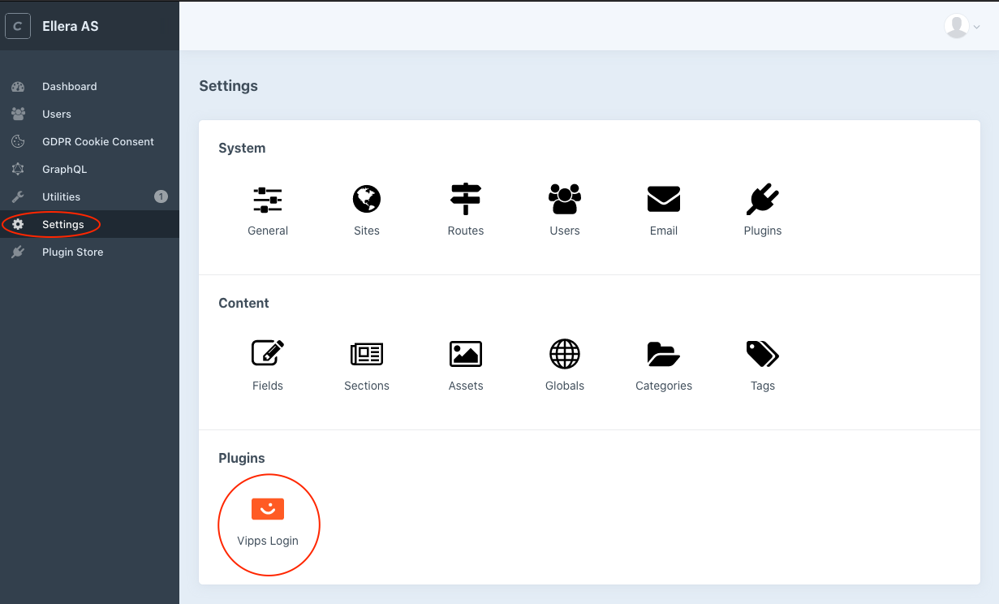
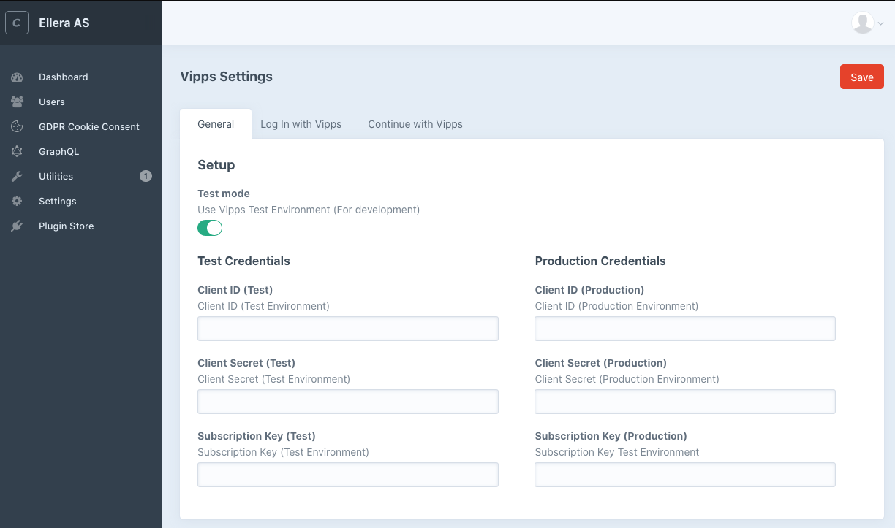
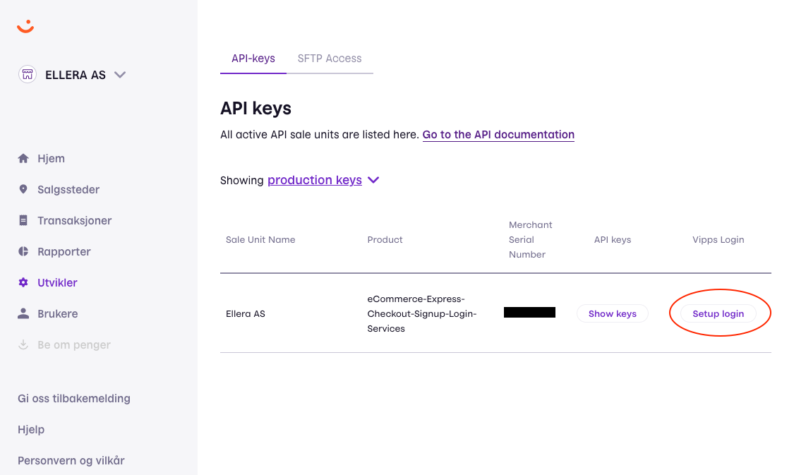
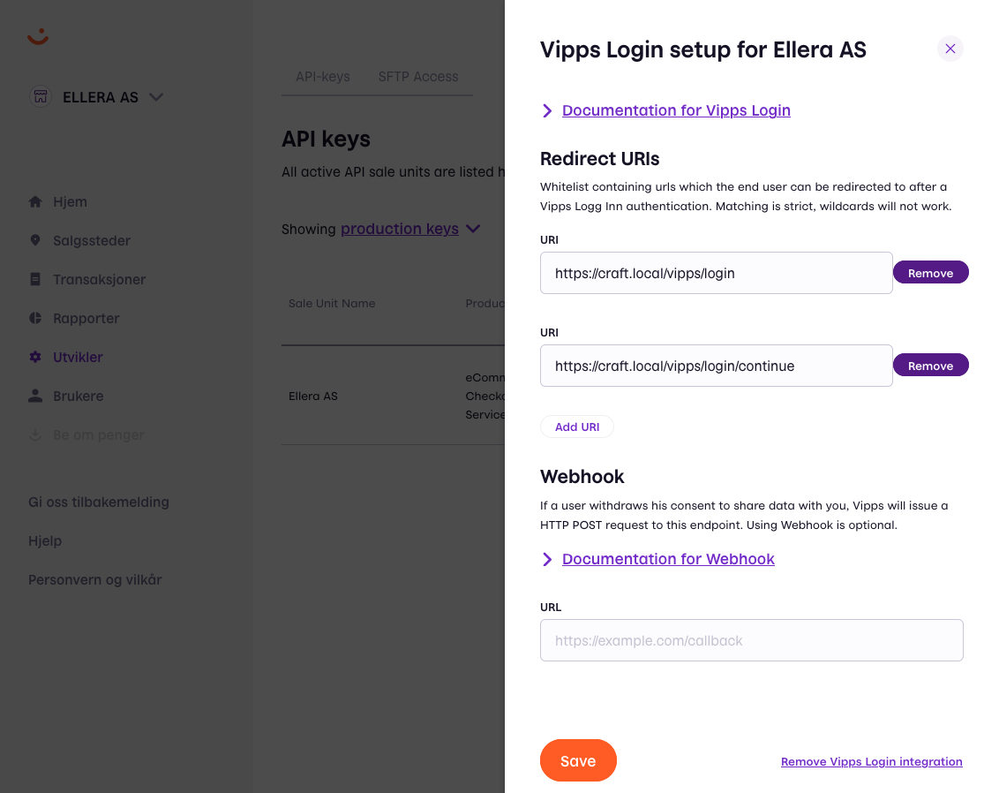
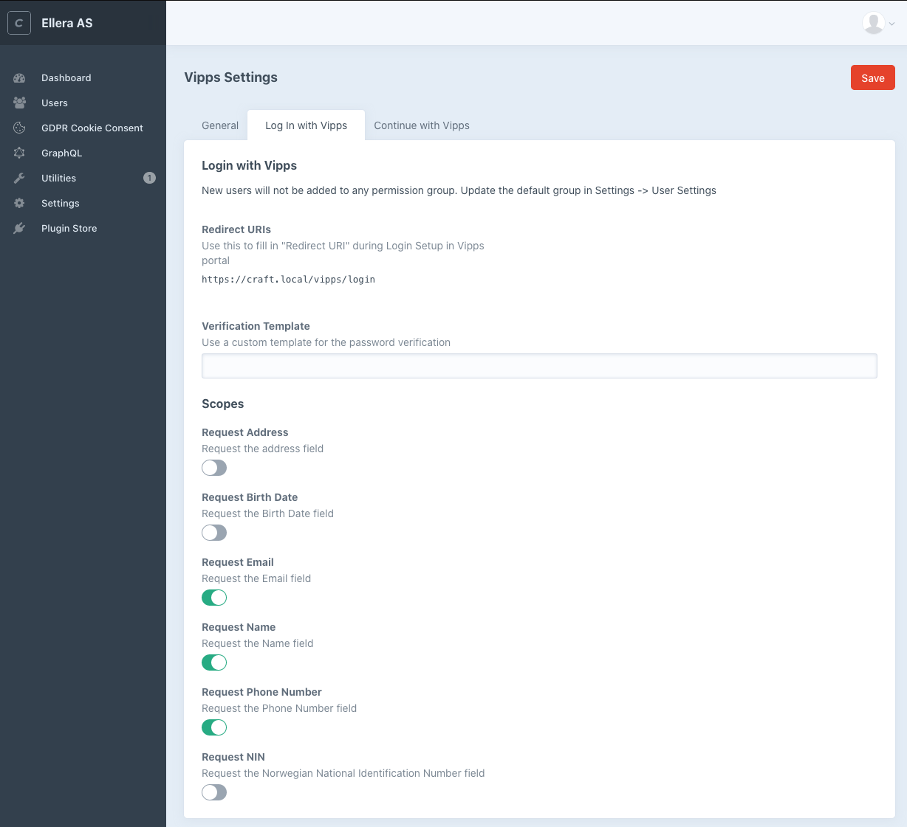
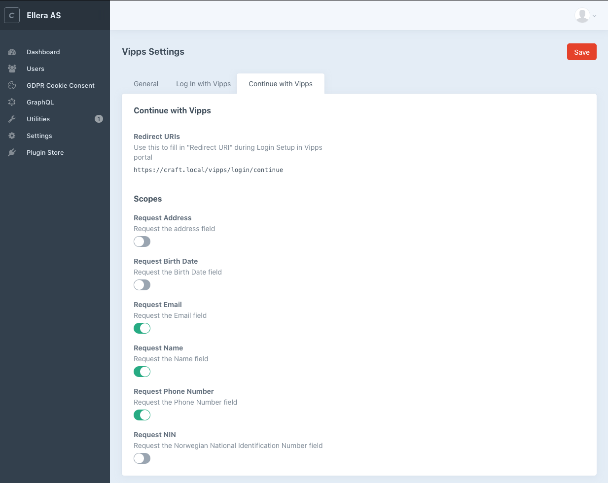

# Vipps Login for CraftCMS

**This plugin is currently a test pilot (pre-release). It is very likely that you will encounter bugs or scenarios that are not yet supported.**

**Please keep up to date with updates as soon as they happen. They are very important in this pre-release period.**

**We encourage you to create an issue here if you require assistance or run in to a problem.**

This plugin provides Vipps Login Integration for CraftCMS / CraftCommerce

# Description

This is the official Vipps Login plugin for [CraftCMS](https://craftcms.com). It is owned by [Vipps AS](https://vipps.no) and maintained by [Ellera AS](https://ellera.no).

With Vipps Login for CraftCMS you can
- Get information about users and visitors via Vipps
- Let users sign up and log in with Vipps
- Link their existing account to Vipps

# Getting started

## Installation

- Sign up to use [Vipps Logg inn](https://vipps.no/produkter-og-tjenester/bedrift/logg-inn-med-vipps/logg-inn-med-vipps/)
- Install the plugin via [Craft Plugin Store](https://plugins.craftcms.com)
- Configure the Settings

## Settings

#### Find the Settings Page
You can find the settings by navigating to Settings -> Vipps Login.


#### Add your credentials
Insert your credentials. You can find these in the [Vipps Portal](https://portal.vipps.no) 


#### Activate Vipps Login and add the redirect URI
In the [Vipps Portal](https://portal.vipps.no), activate Login with Vipps and add the Redirect URI as you find it under "Redirect URIs" in either "Login with Vipps" and/or "Continue with Vipps". 
Also adjust the scopes to suit your applications needs.

###### Setup Login


###### Add Redirect URIs


###### Locate Redirect URIs



## Rendering the button
To render the login button anywhere you can utilize the `loginButton.render()` function of the component the plugin registers.

*Note: All these options work for the `continueButton` as well*
```
{{ craft.vippsLogin.loginButton.render() | raw }}
```
The button defaults to large (250px) rectangle formed button. 
If the language is not given by any of the language functions below, the plugin will used norwegian buttons if the current site language is `nb`, `nn`, `nb-NO` or `nn-NO`. If no language is given, and the current site language is something other than norwegian, english buttons will be used.

The button can be modified by adding functions between `loginButton` and `render()`:

| Function | Description | Example |
| --- | --- | --- |
| `en` or `english` | English text | `craft.vippsLogin.loginButton.en.render()` |
| `no` or `norwegian` | Norwegian text (Default) | `craft.vippsLogin.loginButton.no.render()` |
| `pill` | Pill shape | `craft.vippsLogin.loginButton.pill.render()` |
| `rect` or `rectangle` | Rectangle shape (Default) | `craft.vippsLogin.loginButton.rect.render()` |
| `small` | Small size, 210px | `craft.vippsLogin.loginButton.small.render()` |
| `large` | Large Size, 250px (Default) | `craft.vippsLogin.loginButton.large.render()` |
| `continue` | Change the login button to Continue | `craft.vippsLogin.loginButton.continue.render()`|
| `login` | Change the continue button to Login | `craft.vippsLogin.continueButton.login.render()` |
| `register` | Change the button to Register | `craft.vippsLogin.continueButton.register.render()` |

These functions can be combined;
```
{{ craft.vippsLogin.loginButton.en.pill.small.render() | raw }}
```

You can also add parameters to the `<a>` and `` tag by providing a string in the render function: `render(a, img)`

Append the a tag: 
```
{{ craft.vippsLogin.loginButton.render('rel="external"') | raw }}
```
Append the img tag: 
```
{{ craft.vippsLogin.loginButton.render(null, 'title="Login with Vipps" class="btn"') | raw }}
```
Append to both:
```
{{ craft.vippsLogin.loginButton.render('rel="external"', 'title="Login with Vipps" class="btn"') | raw }}
```

## Rendering your own button
You can also call the function `craft.vippsLogin.getLoginUrl()` or `craft.vippsLogin.getContinueUrl()` to just get the URL.
```
<a href="{{ craft.vippsLogin.getLoginUrl() }}">Log in with Vipps</a>
<a href="{{ craft.vippsLogin.getContinueUrl() }}">Continue with Vipps</a>
```

## Getting user information from Vipps
As long as the user's Vipps token is not expired, you can access the user information with the session object.
```

    <p>Hi, {{ craft.vippsLogin.session.getGivenName }}!</p>

    <p>Not logged in</p>

``` 
#### Attributes of the Session object
| Attribute | Type |Description |
| --- | --- | --- |
| `isExpired` | boolean | Is the Vipps session valid |
| `getExpiresIn` | integer | How long til the Vipps session expires |
| `getAddresses` | array | Array of registered addresses |
| `getEmail` | string | User email |
| `isEmailVerified` | boolean | Is the email verified |
| `getGivenName` | string | Users given name |
| `getFamilyName` | string | Users family name |
| `getName` | string | Users full name |
| `getPhoneNumber` | string | Users phone number |
| `getSid` | string | Returns the Session ID |
| `getSub` | string | Unique ID for this user |
| `getNnin` | string | Returns the Norwegian National Identification Number |
| `getBirthdate` | string | Returns the users birthdate |


## Showing error messages

This plugin utilizes `Craft::$app->session->setFlash()` for outputting error messages.

To show these messages in your template you need to look at the [documentation](https://docs.craftcms.com/api/v3/craft-web-session.html#public-methods) and implement something similar to this:
```


    <p class="{{ key }}">
        {{ message }}
    </p>

```

| Type | Description | Message |
| --- | --- | --- |
| `danger` | Login failed in Vipps | `error_description` from Vipps API |
| `danger` | Login failed in Vipps without message | 'Something went wrong while logging you in. Please try again, if the error persists contact the site administrator.' |

## Changing the Password Verification template
When a user register/login with Vipps and an email that exists, they will be asked to confirm the password and the accounts will be linked.

If the setting under "Verification Template" under the "Log In with Vipps" tab is empty, our example template `vendor/vippsas/vipps-login-craft/src/templates/verify.twig` is used.
To make your own, make a new twig file in your templates folder and update the setting.

If your template is located in `templates/vipps/verify` set the  "Verification Template" option to `vipps/verify`. Use our example template to see the logic and forms that needs to be present.

## Password verification and connecting to existing accounts
When a user attempts to sign up with an email that already exist they are redirected to a password verification page. When they confirm their password the existing account is linked to the Vipps account and the user can log in using Vipps.

The password verification template provided by the plugin is just an example and can be found in `vendor/vippsas/src/templates/verify.twig`. Use this template as a starting point for implementing your own design. Update the field in `Settings -> Log In with Vipps -> Verification Template` with the new template path.

Ex. if your template is `templates/vipps/verification.twig` the settings field should be `vipps/verification`.

## Events
The plugin triggers different events based on the user actions.
These can be used to inject logic.

#### Example code
```
use yii\base\Event;
use vippsas\login\events\LoggedInEvent;
use vippsas\login\VippsLogin;

...

Event::on(
    VippsLogin::class,
    VippsLogin::EVENT_USER_LOGGED_IN,
    function(LoggedInEvent $e) {
        // Implement your own logic here
        // using the $e variable to access 
        // User and Session classes
        die(var_dump([
            'message' => 'User logged in',
            'user' => $e->getUser(),
            'session' => $e->getSession()
        ]));
    }
);
```


#### Events
| Event | Name | Functions | Description |
| --- | --- | --- | --- |
| `vippsas\login\events\LoggedInEvent` | `VippsLogin::EVENT_USER_LOGGED_IN` | `getUser()`, `getSession()` | Triggers when a user is logged in with Vipps. |
| `vippsas\login\events\ContinueEvent` | `VippsLogin::EVENT_USER_CONTINUED` | `getSession()` | Triggers when a user continues with Vipps. |
| `vippsas\login\events\RegisterEvent` | `VippsLogin::EVENT_USER_CREATED` | `getUser()`, `getSession()` | Triggers when a user registers with Vipps. |
| `vippsas\login\events\ConnectEvent` | `VippsLogin::EVENT_USER_CONNECTED_ACCOUNT` | `getUser()`, `getSession()` | Triggers when a user connects an existing account to Vipps. |

## Example Code

Have a look at the twig template located [here](https://github.com/vippsas/vipps-craft-login/blob/master/docs/examples/frontend.twig) for some usage examples. The twig template uses Bulma CSS from a CDN and should work right out of the box if the plugin is installed correctly.

# How can I get help if I have any issues?

For Craft-related issues you should use the resources and communities available [here](https://craftcms.com/community). 

For Plugin-related issues you should create a new issue in the [official repository](https://github.com/vippsas/vipps-craft-login/issues).

For Vipps-related issues, you should contact [Vipps](https://developer.vippsmobilepay.com/).
